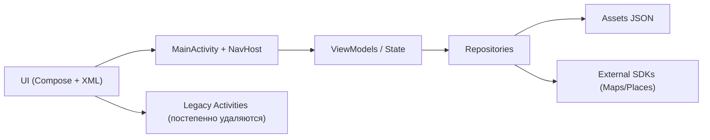

# Ставротека (Stavropol Places App)

Гид по Ставропольскому краю: места, где поесть, афиша, знаменитые земляки и избранное. Проект постепенно мигрирует на Jetpack Compose с единой навигацией через `MainActivity`.

## Возможности
- Места: список, поиск, карточка места.
- Где поесть: список, карточка ресторана с фото и графиком работы.
- Афиша (webview-экран/заглушка).
- Земляки: список и карточка персоны.
- Избранное.

## Технологии и инструменты
- **Kotlin**, **Android SDK 34**, **Java 17**
- **Jetpack Compose** + **Material 3** (основные экраны)
- **Navigation Compose** (single-activity навигация)
- **Hilt** (DI)
- **Coil** (изображения в Compose) + **Glide** (legacy/RecyclerView)
- **Gson** (JSON парсинг)
- **Google Maps/Places SDK** (подготовлено, используется точечно)

## Архитектура
- Гибрид: часть экранов на Compose, часть — legacy XML.
- Единая навигация через `MainActivity` + `NavHost`.
- Данные сейчас локальные, из `app/src/main/assets/*.json`.

### Диаграмма (упрощённо)


## Структура проекта (ключевые каталоги)
```
app/src/main/java/com/example/stavropolplacesapp/
├─ data/                 # источники/репозитории данных
├─ di/                   # Hilt модули
├─ navigation/           # маршруты и навигационные хелперы
├─ presentation/         # Compose-экраны
├─ places/, eat/, famous_people/  # домены/legacy-экраны
├─ ui/                   # общие UI-компоненты и тема
└─ utils/                # утилиты
```

## Данные
Данные хранятся в assets:
- `places.json`
- `eat_place.json`
- `people.json`
- `region.json`

### Формат данных (кратко)
`places.json` (места):
```json
[
  {
    "id": 1,
    "name": "Название места",
    "shortDescription": "Короткое описание",
    "fullDescription": "Полное описание",
    "imageUrl": "https://...",
    "category": "Парки",
    "latitude": 45.0,
    "longitude": 41.0
  }
]
```

`eat_place.json` (где поесть):
```json
[
  {
    "id": 1,
    "name": "Название",
    "description": "Описание",
    "address": "Адрес",
    "phone": "+7...",
    "coordinates": "45.0,41.0",
    "photos": ["https://..."],
    "workingHours": {
      "monday": "10:00-22:00",
      "tuesday": "10:00-22:00",
      "wednesday": "10:00-22:00",
      "thursday": "10:00-22:00",
      "friday": "10:00-23:00",
      "saturday": "10:00-23:00",
      "sunday": "10:00-21:00"
    }
  }
]
```

`people.json` (земляки):
```json
[
  {
    "id": 1,
    "name": "ФИО",
    "imageUrl": "https://...",
    "description": "<p>HTML описание</p>"
  }
]
```

`region.json` (региональные материалы):
```json
[
  {
    "id": 1,
    "title": "Заголовок",
    "description": "Текст",
    "imageUrl": "https://..."
  }
]
```

## Сборка и запуск
Требования:
- Android Studio (Arctic Fox+), JDK 17
- Android SDK 34

Команды:
```bash
./gradlew assembleDebug
```

Установка на устройство:
```bash
adb install -r app/build/outputs/apk/debug/app-debug.apk
```

## Тесты
```bash
./gradlew testDebugUnitTest
```

## CI/CD
GitHub Actions: `.github/workflows/android.yml`
- сборка debug
- unit-тесты

## Примечания
- Firebase временно исключён (не используется).
- Идёт миграция на Compose: часть экранов всё ещё legacy, но навигация унифицирована через `MainActivity`.

## Roadmap (кратко)
- Полный перевод экранов на Compose
- Упрощение навигации (удаление legacy Activity)
- Улучшение карточек и фото-галерей
- Расширение данных и персонализация

---
Если нужно, добавлю диаграммы архитектуры/модули, подробное описание API и формат данных.
